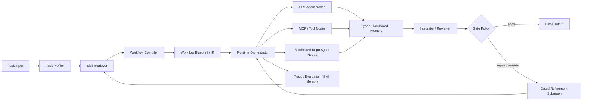

# AgentCo-Op architecture.md

**Version goal**: Define AgentCo-Op as a **task-conditioned workflow compiler**. Unlike AFlow / ADAS, it does not repeatedly search over a candidate workflow space and select designs using validation metrics. Instead, it starts from a task profile, a two-level skill library, and execution constraints, then directly compiles the simplest sufficient multi-agent workflow. During execution, it performs only local, gate-controlled topology repair and execution rerouting.

---

## 1. Research positioning

### 1.1 Differences from AFlow / ADAS

AFlow and ADAS show that the structure of an agentic workflow / agentic system can be automatically discovered, but their core mechanism is still search:

| System | Core mechanism | Strengths | Lessons for AgentCo-Op | How AgentCo-Op differs |
|---|---|---|---|---|
| AFlow | Uses MCTS to optimize complete workflows in a code-represented workflow space; each tree node is a full workflow | Code representation is flexible and can express branching, loops, parallelism, and conditional logic; strong results on multiple benchmarks | Workflows should be represented as executable IR / code; operators can become reusable components; runtime logs and experience should be saved | Does not treat “finding the topology” as the main search problem; uses meta-skills to compile the topology first, then performs only gated local repair during execution |
| ADAS / Meta Agent Search | A meta-agent generates new agentic systems in code space, evaluates them on a validation set, and adds them to an archive | Code space can express prompts, tools, control flow, and multi-agent systems; archives help reuse experience | System designs can be expressed as code contracts; generated code must run in a sandbox; archive / memory can accumulate failure experience | Does not require every new task to have a well-defined validation metric; turns the archive into skill memory rather than a search driver |
| AgentCo-Op | Compiles a workflow from a task profile + meta-skills + agent-skills; dynamically refines the workflow at runtime | Suitable for tasks with unclear metrics, changing task types, and scenarios that need to wrap existing repos / agents | — | The key contribution is “compilation + dynamic local repair + specialized execution backend federation” |

Suggested core claim:

> AgentCo-Op treats multi-agent system design as **task-conditioned compilation** rather than validation-driven search. It maps a task profile and a two-level skill library into the simplest workflow that satisfies capability, evidence, safety, and budget constraints, while allowing local topology refinement during execution.

### 1.2 Why the system must be simplicity-first

Multi-agent workflows should not be the default. Official agent architecture guidance from OpenAI and Anthropic emphasizes starting by maximizing single-agent capability, and splitting into multi-agent systems only when the task has clear tool isolation, context isolation, complex branching, conflicting specialist roles, or a need for independent review. Multi-agent systems increase tokens, latency, trace complexity, handoff errors, tool approval surface area, and prompt maintenance cost.

AgentCo-Op therefore makes the **minimal sufficient topology** the compilation target, rather than generating a complex graph by default.

---

## 2. Overall architecture

AgentCo-Op consists of 8 core modules:



### 2.1 Module responsibilities

| Module | Input | Output | Responsibility |
|---|---|---|---|
| Task Profiler | User task, constraints, available data, expected output | `TaskProfile` | Determine task type, answer mode, complexity, verifiability, tool needs, risk, budget, and whether repo execution is needed |
| Skill Retriever | `TaskProfile`, skill library, historical traces | meta-skill candidates + agent-skill candidates | Retrieve topology rules, task-domain skills, callable tools, and wrappable repos |
| Workflow Compiler | profile + skills + constraints | `WorkflowBlueprint` | Select the minimal sufficient topology; bind agent-skills; generate nodes, edges, gates, memory scopes, and eval contracts |
| Runtime Orchestrator | blueprint + task instance | execution trace + artifacts | Execute the graph; manage async execution, timeouts, budgets, failure recovery, and context isolation |
| Execution Backends | node spec + typed input | typed output + confidence + artifacts | Support LLM agents, MCP tools, sandboxed repos / agents, code runners, and retrievers |
| Memory System | traces, artifacts, summaries, skills | scoped context | Isolate node scratchpads, aggregate a shared blackboard, and store reusable experience rather than unbounded chat history |
| Integrator / Reviewer | node outputs + evidence + eval contract | final answer / repair request | Fuse results, validate format, estimate confidence, and trigger gates |
| Gated Refinement Subgraph | failure signal + current state | patch plan / repaired graph fragment | Locally repair plans, rerun specialists, replace backends, add reviewers, or fall back to single-agent execution |

---

## 3. Core data models

AgentCo-Op should compile workflows into a strongly typed IR rather than storing only natural-language prompts. Use Pydantic / dataclasses to define the following objects.

### 3.1 `TaskProfile`

```python
class TaskProfile(BaseModel):
    task_id: str
    raw_task: str
    domain: list[str]              # math, code, QA, bio, spatial, planning, etc.
    answer_type: str               # short_answer, program, proof, report, ranking, artifact
    objective: str                 # solve, explain, rank, synthesize, experiment_design
    difficulty: str                # trivial, simple, moderate, complex, open_ended
    decomposition_need: float      # 0-1
    tool_need: float               # 0-1
    retrieval_need: float          # 0-1
    repo_execution_need: float     # 0-1
    verification_available: str    # exact, unit_test, deterministic_grader, rubric, none
    risk_level: str                # low, medium, high
    budget: dict                   # max_tokens, max_cost, max_latency, max_iterations
    output_schema: dict | None
    constraints: list[str]
```

### 3.2 `MetaSkill`

A meta-skill is a compilation rule for choosing a topology for a class of tasks, not domain knowledge itself. It should be a human-readable, version-controlled YAML/Markdown skill card.

```yaml
name: code_test_repair_loop
kind: meta_skill
version: 0.1
intent: >
  For coding tasks with executable tests, compile a programmer -> sandbox test -> repair loop.
task_signals:
  domains: [code]
  answer_type: [program]
  verification_available: [unit_test, hidden_tests]
when_to_use:
  - User asks for implementation or bug fix.
  - Tests or examples are available.
when_not_to_use:
  - Pure conceptual code explanation.
  - No sandbox permission and high risk side effects.
topology_template:
  nodes:
    - planner
    - programmer
    - sandbox_test
    - reviewer
  gates:
    - on_test_failure: repair_or_reroute
complexity_penalty: 0.45
expected_benefit: high_when_tests_exist
memory_policy: isolated_scratch_plus_artifact_blackboard
evidence_refs:
  - AFlow uses Programmer/Test/Review/Revise style operators.
  - Anthropic recommends evaluator-optimizer loops when clear evaluation criteria exist.
```

### 3.3 `AgentSkill`

An agent-skill is a capability contract describing what a specific agent / tool / repo can do.

```yaml
name: SpatialAgent
kind: agent_skill
backend_type: sandbox_repo
source:
  repo: https://github.com/Genentech/SpatialAgent
  commit: <pinned-sha>
capabilities:
  - spatial_transcriptomics_qc
  - cell_typing
  - differential_expression
  - spatial_analysis
input_contract:
  dataset_path: str
  question: str
  output_dir: str
output_contract:
  answer: str
  artifacts: list[str]
  confidence: float
requirements:
  gpu: optional
  network: optional_false_by_default
  secrets: [OPENAI_API_KEY, ANTHROPIC_API_KEY]
risk:
  code_execution: true
  data_exfiltration: medium
```

### 3.4 `WorkflowBlueprint`

```python
class WorkflowBlueprint(BaseModel):
    blueprint_id: str
    task_profile: TaskProfile
    nodes: list[NodeSpec]
    edges: list[EdgeSpec]
    gate_policies: list[GatePolicy]
    memory_plan: MemoryPlan
    eval_contract: EvalContract
    budget: Budget
    provenance: list[str]          # which skills / references produced this graph
```

### 3.5 `NodeSpec`

```python
class NodeSpec(BaseModel):
    node_id: str
    role: str                      # router, specialist, tool, sandbox_agent, reviewer, integrator
    backend: str                   # llm, mcp, sandbox_repo, python_tool, retriever
    skill_refs: list[str]
    input_schema: dict
    output_schema: dict
    memory_scope: str              # private, shared_read, shared_write, artifact_only
    prompt_template: str | None
    tool_policy: dict
    timeout_s: int
    max_retries: int
    confidence_policy: dict
```

---

## 4. Compilation algorithm

### 4.1 Compilation objective

AgentCo-Op does not search for the optimal workflow. It solves a **constraint satisfaction + minimal complexity** problem:

```text
Choose workflow W that maximizes:
    capability_coverage(W, task)
  + evidence_support(W, task)
  + verification_strength(W, task)
  - complexity_penalty(W)
  - cost_penalty(W)
  - risk_penalty(W)

Subject to:
  - output schema is satisfiable
  - required tools / data access are available
  - risk policy is satisfied
  - budget is not exceeded
  - at least one verification or review path exists for non-trivial tasks
```

The key point is that **complexity penalty is a first-class objective**. If direct / single-agent execution can satisfy the task, the system should not escalate to a multi-agent workflow.

### 4.2 Compilation flow

```python
def compile_workflow(task: str, constraints: dict) -> WorkflowBlueprint:
    profile = profile_task(task, constraints)

    meta_candidates = retrieve_meta_skills(profile)
    agent_candidates = retrieve_agent_skills(profile)

    feasible = []
    for meta in meta_candidates:
        if not meta.preconditions_satisfied(profile):
            continue
        graph = instantiate_topology(meta.topology_template, profile)
        graph = bind_agent_skills(graph, agent_candidates, profile)
        graph = attach_memory_policy(graph, profile)
        graph = attach_gate_policy(graph, profile)
        graph = attach_eval_contract(graph, profile)
        if satisfies_hard_constraints(graph, profile):
            feasible.append(graph)

    return choose_simplest_sufficient_graph(feasible, profile)
```

### 4.3 Decision ladder for the “minimal sufficient graph”

Use the following topology ladder:

| Level | Topology | Trigger condition | When not to use |
|---:|---|---|---|
| L0 | Direct answer | Simple QA, low risk, no tools needed, can be completed in one pass | Requires updated facts, computation, code execution, or long context |
| L1 | Single agent + tools | Single objective, but needs retrieval, calculator, code execution, or file operations | Too many tools causing selection confusion; broad domain span |
| L2 | Prompt chain | Clearly decomposable into fixed steps, such as extract → reason → format | Subtask order is unstable or must be dynamically discovered |
| L3 | Router → specialist | Input types are clearly distinct, such as math/code/QA/biology; each type has different prompts/tools | Only one specialist will be used, making routing overhead wasteful |
| L4 | Parallel specialists / voting | Requires multiple perspectives, answer diversity, self-consistency, or safety review | Answer can be verified directly by a deterministic tool |
| L5 | Orchestrator-workers | The subtask set is discovered at runtime, such as large codebases, open research, complex data analysis | Task can be solved by a fixed chain |
| L6 | Evaluator-optimizer / repair loop | Clear grader, tests, format constraints, or iterative improvement criteria exist | No clear evaluation standard; iteration would only add cost |
| L7 | Repo federation / specialized agent collaboration | Requires existing repos / domain agents / sandbox artifacts | Repo installation is unstable, or the task does not need that specialized system |

### 4.4 Examples of mapping tasks to topologies

| Task | Profile | Recommended topology |
|---|---|---|
| Simple GSM8K arithmetic | math, short_answer, exact metric, low tool need | L1: single math agent + optional calculator; gate to self-check only on low confidence |
| MATH level 5 number theory | math, high difficulty, exact answer | L3/L4: router selects number theory specialist; parallel solution + reviewer; gated repair on disagreement |
| HumanEval | code, unit tests, executable | L6: programmer → sandbox test → repair loop → final formatter |
| HotpotQA | multi-hop QA, high retrieval need, answer F1 | L2/L5: retrieval planner → evidence retrievers → answer synthesizer → citation/evidence reviewer |
| DROP | reading comprehension + numeric reasoning | L3: reader/extractor + numeric reasoning specialist + answer formatter |
| Spatial transcriptomics analysis | biology + spatial + code/data execution | L7: orchestrator + SpatialAgent sandbox node + domain reviewer + artifact memory |
| Cross-repo bio collaboration | spatial analysis + perturbation design | L7: SpatialAgent produces spatial gene programs; BioDiscoveryAgent prioritizes perturbations; integrator validates evidence |

---

## 5. Two-level skill system

### 5.1 Meta-skills

Meta-skills define the basis for topology selection. Most should be predefined, and each should include both supporting evidence and counterexamples.

The initial version should include the following meta-skills:

| meta-skill | Purpose |
|---|---|
| `simple_direct_answer` | Force low-complexity tasks into direct or single-agent execution to avoid unnecessary multi-agent overhead |
| `single_agent_tool_use` | Let one agent manage a small set of tools; suitable for simple retrieval, computation, and file tasks |
| `retrieval_grounded_qa` | Compile retrieval → evidence selection → answer for HotpotQA / open-domain QA |
| `numeric_reading_comprehension` | Compile span extraction + arithmetic reasoning + formatter for DROP-style tasks |
| `math_specialist_route` | Select specialists based on labels such as algebra, number theory, and combinatorics |
| `parallel_self_consistency` | For high-uncertainty math/reasoning tasks, run parallel samples or multiple specialists and aggregate |
| `code_test_repair_loop` | Compile programmer → tests → repair for executable coding tasks |
| `orchestrator_workers_research` | Let an orchestrator dynamically decompose open research tasks |
| `evaluator_optimizer` | Enable refinement loops when clear evaluation criteria exist |
| `sandbox_repo_execution` | Wrap GitHub repos / external agents as execution nodes |
| `domain_agent_collaboration` | Coordinate upstream/downstream collaboration and conflict resolution between two specialized agents |
| `human_review_for_high_risk` | Require approval for high-risk tools, file writes, network access, external API calls, or unknown code execution |

### 5.2 Agent-skills

Agent-skills can be pre-registered or discovered by the system after receiving an input task.

Sources of agent-skills include:

1. **Prompt skills**: calculus solver, number theory solver, DROP arithmetic solver.
2. **Tool skills**: retriever, calculator, Python runner, unit-test runner, citation checker.
3. **MCP skills**: GitHub, filesystem, database, browser, document store.
4. **Sandbox repo skills**: BioDiscoveryAgent, SpatialAgent, mini-SWE-agent, custom lab tools.
5. **Composite skills**: reusable nodes composed of multiple tools and prompts, such as “literature-reviewer-with-citation-check”.

Each agent-skill must declare its capability boundaries, input/output schemas, dependencies, installation method, risk level, verifiable outputs, cost estimate, and applicable task tags.

---

## 6. Runtime workflow

### 6.1 Base graph

The base graph is the normal execution path produced by compilation. A typical structure is:

```text
Router / Task Specializer
    → Specialist A / Execution Node 1
    → Specialist B / Execution Node 2
    → Integrator
    → Reviewer
    → Finalizer
```

For simple tasks, the base graph can degenerate to:

```text
SingleAgent → Finalizer
```

For coding tasks:

```text
Planner → Programmer → SandboxTest → Reviewer → Finalizer
                     ↑        ↓
                 Repair ← TestFailureGate
```

### 6.2 Gated refinement subgraph

Gated refinement is not another workflow search. It only applies local patches to the current run.

#### Trigger signals

| gate trigger | Example | Refinement action |
|---|---|---|
| `low_confidence` | reviewer confidence < threshold | Add a second specialist or rerun with a stricter prompt |
| `schema_invalid` | Output does not satisfy JSON / answer schema | Invoke formatter / repair node |
| `test_failure` | HumanEval tests fail | Send error logs back to the programmer, up to N times |
| `evidence_missing` | QA answer lacks supporting evidence | Add retrieval node or citation checker |
| `specialist_disagreement` | Two math specialists disagree | Start judge / proof checker / third solver |
| `tool_error` | Repo install/run fails | Switch fallback tool, rebuild image, or degrade to LLM summary |
| `budget_near_limit` | token/cost is near the cap | Stop graph expansion and output best effort with uncertainty |
| `risk_escalation` | Unknown shell command, network access, write to external resource | Request human approval or refuse execution |

#### Local patch operations

```python
class GraphPatch(Enum):
    RETRY_NODE = "retry_node"
    REPLACE_BACKEND = "replace_backend"
    ADD_REVIEWER = "add_reviewer"
    ADD_RETRIEVAL = "add_retrieval"
    ADD_SPECIALIST = "add_specialist"
    ADD_TEST_NODE = "add_test_node"
    REROUTE_TO_SIMPLE = "reroute_to_simple"
    ESCALATE_HUMAN = "escalate_human"
    TERMINATE_WITH_UNCERTAINTY = "terminate_with_uncertainty"
```

### 6.3 Reviewer / integrator policy

The reviewer should not merely “ask another LLM.” It must be bound to the task’s `EvalContract`:

| Task type | Reviewer checks |
|---|---|
| Math | Whether the final answer can be extracted; whether the reasoning is self-consistent; whether a calculator / symbolic checker was used when available |
| Code | Public tests, hidden tests, lint, runtime errors, whether the patch is minimal |
| QA | Answer span, supporting evidence, hallucination risk, normalized F1-compatible format |
| DROP | Numeric computation, units, consistency between spans and arithmetic operations |
| Bio / spatial | Whether artifacts exist, whether analysis steps are reproducible, whether gene lists are supported by evidence, whether statistical methods are reasonable |
| Repo execution | Command exit code, output files, abnormal logs, version and commit hash |

---

## 7. Execution backends

One of AgentCo-Op’s important contributions is unifying different execution nodes under the same contract.

### 7.1 Backend types

| Backend | Use case | Input/output |
|---|---|---|
| `llm_agent` | planner, specialist, reviewer, integrator | structured messages → structured output |
| `mcp_tool` | GitHub, filesystem, database, browser, retriever | JSON input → JSON output |
| `python_sandbox` | Lightweight computation, tests, data processing | code / command → artifacts + logs |
| `sandbox_repo` | Wrapped GitHub repo or existing agent | manifest command → artifacts + logs |
| `human_review` | High-risk approval or expert annotation | review request → approved/rejected/comment |

### 7.2 Repo execution node contract

Each GitHub repo is wrapped as a `RepoSkill`:

```yaml
name: BioDiscoveryAgent
backend_type: sandbox_repo
repo_url: https://github.com/snap-stanford/BioDiscoveryAgent
commit_sha: <pinned>
build:
  dockerfile: Dockerfile.agentcoop
  context: .
run:
  entrypoint: python -m agentcoop_wrappers.biodiscovery
  args_schema:
    dataset: str
    num_steps: int
    num_genes: int
    use_lit_review: bool
    use_critique: bool
resources:
  cpu: 8
  memory_gb: 32
  gpu: false
  timeout_s: 7200
security:
  network: allowlist
  mounts:
    - input: read_only
    - output: read_write
  secrets:
    - ANTHROPIC_API_KEY
outputs:
  result_json: /outputs/result.json
  logs: /outputs/logs.txt
```

### 7.3 Sandbox principles

1. **Pin the commit SHA**: Avoid unreproducible drift from the repo’s main branch.
2. **Run as a non-root user**: Do not use privileged mode in the container.
3. **Mount inputs read-only**: Input data must not be modified.
4. **Mount outputs separately**: All artifacts must be written to `/outputs`.
5. **Disable network by default**: When network is required, use an allowlist proxy and log requests.
6. **Keep secrets out of model-writable code environments**: Inject them through a controlled wrapper and only into necessary processes.
7. **Limit resources**: CPU, memory, GPU, disk, and timeout.
8. **Record the full command and environment**: image hash, commit SHA, package lock, stdout/stderr.
9. **Require approval for high-risk commands**: installation scripts, external uploads, file deletion, long network access, or writes to system paths.

---

## 8. Memory architecture

### 8.1 Design goals

AgentCo-Op memory should not be one unlimited chat history shared by all agents. A better design is:

- **Isolation**: Each node has private scratch space, preventing irrelevant context contamination and lateral prompt-injection propagation.
- **Aggregation**: The shared blackboard stores only typed artifacts, short summaries, evidence references, and result schemas.
- **Reproducibility**: All runtime logs, commands, versions, and input/output hashes are traceable.
- **Learning without training**: Convert success/failure cases into skill memory for future compilation rule weights or warnings.

### 8.2 Memory levels

| Level | Lifecycle | Content | Access |
|---|---|---|---|
| `RunState` | Single run | Current task, budget, node states, gate states | orchestrator |
| `NodeScratch` | Single node / single run | Private intermediate reasoning summaries, temporary plans, tool log summaries | node private |
| `Blackboard` | Single run | typed outputs, artifacts, evidence, confidence, error summary | scoped shared |
| `ArtifactStore` | Across nodes / runs | Files, code patches, data-processing results, sandbox outputs | read by permission |
| `TraceStore` | Across runs | JSONL spans, cost, latency, tokens, errors, patches | evaluator/compiler |
| `SkillMemory` | Long term | Which skills/topologies succeeded or failed for which task profiles | compiler/retriever |
| `RepoRegistry` | Long term | repo wrapper manifests, image hashes, smoke-test status | sandbox manager |

### 8.3 Context isolation strategy

- Specialist nodes receive only the task subquestion, necessary constraints, summaries of upstream artifacts, and their own role instruction.
- Reviewer nodes receive the final candidate, evidence, schema, eval contract, and necessary log summaries; they do not need the full conversations of all agents.
- Repo execution nodes receive strict JSON parameters and input file paths; they do not receive the full high-level agent conversation.
- The integrator receives structured outputs from each node, not raw chain-of-thought.
- Long-term memory stores only displayable reasoning summaries / decision rationales / failure modes, not private chain-of-thought.

---

## 9. Topology templates

### 9.1 Single-agent fallback

```text
Task → SingleAgentWithOptionalTools → SchemaFormatter → Final
```

Suitable for simple and low-budget tasks. AgentCo-Op should always evaluate whether this topology is sufficient before escalating.

### 9.2 Retrieval-grounded QA

```text
TaskProfiler
  → QueryPlanner
  → Retriever(s)
  → EvidenceSelector
  → Answerer
  → EvidenceReviewer
  → Finalizer
```

Dynamic gate: expand retrieval when evidence is insufficient; rewrite the answer when it conflicts with evidence; output an answer with uncertainty when the budget is insufficient.

### 9.3 Math specialist + verifier

```text
TaskProfiler
  → MathRouter
  → Specialist(s): algebra / number_theory / combinatorics / geometry
  → Verifier / Calculator / SymbolicChecker
  → Integrator
```

Dynamic gate: add a third solver when answers disagree; require shorter final-answer extraction when verification is unavailable.

### 9.4 Code test-repair loop

```text
Planner
  → Programmer
  → SandboxTest
      ├── pass → Reviewer → Finalizer
      └── fail → RepairPlanner → Programmer / PatchGenerator → SandboxTest
```

Dynamic gate: stop after the maximum number of repairs; if the error is environmental, switch to environment repair rather than changing the algorithm.

### 9.5 Repo federation / specialized agent collaboration

```text
HighLevelPlanner
  → RepoSkillAdapter A
  → RepoSkillAdapter B
  → DomainIntegrator
  → ReproducibilityReviewer
  → FinalReport
```

For BioDiscoveryAgent + SpatialAgent:

```text
TaskProfiler
  → SpatialAnalysisPlanner
  → SpatialAgentSandbox
  → SpatialGeneProgramExtractor
  → BioDiscoveryAgentSandbox
  → BioPerturbationReviewer
  → IntegratedHypothesisReport
```

This structure should be used only when the task truly requires collaboration between both systems. If the task is only spatial transcriptomics analysis, call only SpatialAgent. If the task is only perturbation screen design, call only BioDiscoveryAgent.

---

## 10. Evidence-backed design rationale

| Design | Rationale | AgentCo-Op implementation |
|---|---|---|
| Simplicity-first instead of default multi-agent | Anthropic’s “Building effective agents” emphasizes simple composable patterns; the OpenAI guide recommends maximizing single-agent capability before decomposing for tool/logic complexity | Add complexity penalty to the compilation objective; use a topology ladder from L0 to L7 |
| Represent workflows as code / IR | AFlow uses code representation to express branching, loops, parallelism, and conditions; ADAS uses code-defined agents as the search space | `WorkflowBlueprint` + `NodeSpec` + `GatePolicy`, which can also be lowered to a Python runtime |
| Dynamic repair must be gate-controlled | Anthropic’s evaluator-optimizer pattern works when clear evaluation criteria exist; agent loops need stopping conditions and guardrails | Trigger local patches only on signals such as schema/test/evidence/confidence/tool errors |
| Manager / specialist pattern | OpenAI guidance divides multi-agent patterns into manager-as-tool and handoff; managers are suitable for synthesizing specialist outputs | AgentCo-Op uses a high-level planner / integrator by default to control specialized execution nodes |
| Independent contexts and specialized tool permissions | Anthropic Claude Code subagents use separate context and specific tools | Declare `memory_scope` and tool policy separately for each node |
| Skills as on-demand capabilities | Anthropic Agent Skills load `SKILL.md` and descriptions on demand | meta-skills / agent-skills are searchable skill cards loaded by `TaskProfile` |
| Sandbox repo execution | ADAS explicitly warns about model-generated code risks and uses containerized execution; OpenAI sandbox docs emphasize controlled environments | `sandbox_repo` backend, pinned commits, non-root execution, network allowlists, and resource limits |
| Observability | OpenAI Agents SDK tracing records model calls, tool calls, handoffs, and guardrails | TraceStore records each node span, tokens, cost, latency, gates, and artifacts |
| Memory requires isolation and aggregation | Generative Agents demonstrates memory streams / reflection / planning; modern subagent systems emphasize independent contexts | `NodeScratch` is private, `Blackboard` is typed shared state, and `SkillMemory` stores long-term rules |

---

## 11. Expected contributions of AgentCo-Op

### 11.1 Method contributions

1. **Task-conditioned workflow compilation**: Convert multi-agent topology synthesis from validation-driven search to skill-guided compilation.
2. **Two-level skill system**: Meta-skills determine topology; agent-skills determine node capabilities and backends.
3. **Simplicity-first topology selection**: Explicitly penalize unnecessary multi-agent complexity.
4. **Gated local refinement**: Dynamically modify the graph during execution, but only through local repairs rather than global search.
5. **Specialized execution backend federation**: Unify existing GitHub repos / agents / MCP tools / sandbox code runners as node backends.
6. **Scoped memory for multi-agent collaboration**: Context isolation + typed blackboard + trace/skill memory.

### 11.2 Empirical contributions

1. On the six AFlow-aligned standard benchmarks, compare compiled workflows with search-based workflows in performance, cost, latency, and robustness.
2. Demonstrate why simple tasks should use simple topologies by showing the negative returns of forced multi-agent execution on some tasks.
3. Show that dynamic gated repair gains come from a small number of interpretable gates, not blind iteration.
4. Demonstrate the feasibility of wrapping two real specialized agents / repos into a single collaborative workflow.

---

## 12. Failure modes and mitigations

| Failure mode | Symptom | Mitigation |
|---|---|---|
| Over-compilation | Simple tasks are split into multiple agents, increasing cost and reducing accuracy | complexity penalty; L0/L1 baseline gate; mandatory route distribution logging |
| Skill mismatch | Wrong topology or specialist is selected | TaskProfiler outputs confidence; run a lightweight fallback in parallel for low-confidence routes |
| Reviewer hallucination | Reviewer rejects a correct answer or accepts a wrong one | Bind reviewer to deterministic evaluation / schema / evidence rather than free-form commentary |
| Infinite repair | Test/format failures repeat | max iterations, budget gates, failure taxonomy, terminate with uncertainty |
| Repo setup failure | Dependency conflicts, stale APIs, slow installation | pinned commits, cached images, smoke tests, fallback wrappers |
| Sandbox risk | Repo execution runs malicious code or leaks data | network off by default, non-root, read-only inputs, secret isolation, approval gate |
| Memory pollution | One agent’s wrong assumption contaminates all nodes | private scratch + typed blackboard; share only evidence and artifacts |
| Benchmark leakage | Dataset was in training data or prompt was seen before | Use held-out splits, report contamination caveats, compare cost and routing rather than only SOTA |
| Biology task unverifiable | Specialized collaboration lacks ground truth | Separate exploratory experiments from verifiable benchmarks; use deterministic graders or retrospective screens |

---

## 13. Minimal viable system

The MVP does not need to implement every module at once. Recommended minimal loop:

1. **IR + Runtime**: `TaskProfile`, `WorkflowBlueprint`, `NodeSpec`, topological executor.
2. **Skill library v0**: 10 meta-skills + several agent-skills.
3. **Top 6 benchmarks**: Implement task profilers, compilers, and evaluators for math/code/QA.
4. **Gate v0**: schema invalid, test failure, low confidence, tool error.
5. **Sandbox v0**: Wrap one simple repo + HumanEval code runner.
6. **Trace v0**: JSONL spans + cost/latency/tokens + gate count.
7. **Repo federation demo**: Wrap SpatialAgent or BioDiscoveryAgent, run a smoke test first, then run small-scale tasks.

---

## 14. References

- AFlow paper: https://arxiv.org/abs/2410.10762
- AFlow code: https://github.com/FoundationAgents/AFlow
- ADAS paper: https://arxiv.org/abs/2408.08435
- ADAS code: https://github.com/ShengranHu/ADAS
- Anthropic, “Building effective agents”: https://www.anthropic.com/engineering/building-effective-agents
- Anthropic, Model Context Protocol: https://www.anthropic.com/news/model-context-protocol
- Anthropic Claude Code subagents docs: https://docs.anthropic.com/en/docs/claude-code/sub-agents
- Anthropic Agent Skills docs: https://docs.anthropic.com/en/docs/claude-code/skills
- OpenAI, “A practical guide to building agents”: https://cdn.openai.com/business-guides-and-resources/a-practical-guide-to-building-agents.pdf
- OpenAI Agents SDK docs: https://platform.openai.com/docs/guides/agents-sdk
- OpenAI Sandbox Agents docs: https://platform.openai.com/docs/guides/sandbox-agents
- GPTSwarm: https://arxiv.org/abs/2402.16823
- DyLAN: https://arxiv.org/abs/2310.02170
- MetaGPT: https://arxiv.org/abs/2308.00352
- AutoGen: https://arxiv.org/abs/2308.08155
- CAMEL: https://arxiv.org/abs/2303.17760
- Generative Agents: https://arxiv.org/abs/2304.03442
- BioDiscoveryAgent paper: https://arxiv.org/abs/2405.17631
- BioDiscoveryAgent code: https://github.com/snap-stanford/BioDiscoveryAgent
- SpatialAgent code: https://github.com/Genentech/SpatialAgent
- SpatialBench code: https://github.com/Genentech/SpatialBench
