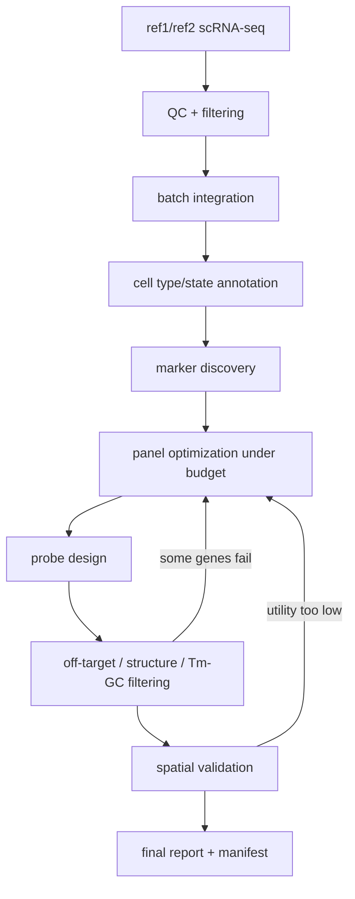

# Benchmark Proposal: Closed-loop Spatial Panel Design and Validation for a Computational Biology Agent

## 1. Background and Objective

The goal of this benchmark is to test whether a **computational biology agent workflow** truly has the following capabilities, rather than merely being able to “write some analysis code”:

1. **Cross-tool orchestration**: Can it correctly switch among Python, R, and command-line bioinformatics tools?
2. **Cross-environment execution**: Can it run different dependency stacks in multiple Docker containers / sandboxes without causing environment pollution or version conflicts?
3. **Dependency management**: Can it understand which steps depend on which intermediate artifacts, and correctly save and reuse them?
4. **Closed-loop optimization**: When downstream probe / panel design fails, can it roll back to upstream gene selection and replan, instead of simply exiting with an error?
5. **Result integration and reproducibility**: Can it output the final panel, probe design, spatial validation results, and a complete run manifest?

The reason for choosing **“starting from a single-cell reference, automatically designing a targeted spatial panel / probes, and then validating it on held-out spatial data”** as the task is that this problem naturally sits between “whole-transcriptome reference” and “limited targeted spatial panel.” sc/snRNA-seq provides a high-throughput reference, while spatial technologies provide spatial structure; however, targeted in situ technologies are limited by the number of genes that can be assayed. Methods such as Tangram and cell2location also rely on shared genes and matched tissue context between single-cell reference data and spatial data. In addition, 10x’s Xenium panel design workflow explicitly requires users to prioritize the gene list and recommends submitting 10–20 backup genes, since some genes may need to be replaced during the design process; for rare cell populations, specific markers must also be deliberately included. This logic aligns closely with the “failure-triggered rollback and replanning” behavior that we want this benchmark to test. ([Nature][1])

---

## 2. Core Task Definition

### 2.1 Task Name

**Closed-loop Spatial Panel Design and Validation**

### 2.2 Task Description

Given:

* two **scRNA-seq reference datasets** from different batches / platforms / study splits,
* one **held-out spatial transcriptomics dataset**,
* a panel budget (e.g., 96 or 128 genes),
* a set of probe / oligo design constraints,
* several callable tools, as well as multiple Docker containers / sandboxes with different dependency stacks,

the agent is required to automatically complete:

1. scRNA-seq QC and preprocessing;
2. cross-batch / cross-platform integration;
3. cell-type / cell-state annotation;
4. marker gene discovery and candidate panel construction;
5. panel optimization under the budget constraint;
6. probe / oligo design for candidate panel genes;
7. filtering based on off-target risk, structure, Tm, GC content, etc.;
8. validation of the panel’s spatial recovery ability using held-out spatial data;
9. automatic replacement of genes that fail probe design, followed by re-validation;
10. generation of a complete report and reproducible artifacts.

### 2.3 Why This Task Is Well-Suited for Evaluating Agent Workflows

This task is not a linear “script pipeline,” but a closed-loop task with feedback:

* Marker genes selected upstream are **not guaranteed** to pass downstream probe design;
* Failures in downstream probe feasibility impose constraints on upstream panel selection;
* Whether a final panel is actually useful is not determined by whether the markers “look reasonable,” but by whether it preserves biological and spatial signal on held-out spatial data.

Therefore, this task simultaneously exposes the agent’s:

* planning ability,
* tool selection ability,
* environment selection ability,
* failure recovery ability,
* state and artifact management ability.

---

## 3. Why This Design

## 3.1 This Is a Truly Multi-Tool Task, Not a Pseudo Multi-Step Task

Single-cell and spatial integration naturally spans the Python / PyTorch ecosystem: Scanpy is an extensible toolkit for single-cell analysis that supports preprocessing, clustering, visualization, and differential analysis; scvi-tools provides probabilistic models based on PyTorch / Pyro such as scVI and scANVI; Tangram relies on PyTorch and Scanpy to map sc/snRNA-seq data to spatial data; and cell2location uses a Bayesian model to explain spatial counts using reference signatures from single-cell data. Meanwhile, SingleR lives in the Bioconductor ecosystem for automated annotation, while CellTypist is another automated annotation framework in Python. On the sequence design side, tools such as Primer3, BLAST+, Bowtie2, and ViennaRNA are often command-line or native binary tools. In other words, this task naturally spans **Python + R + native CLI bioinformatics tools**. ([Project name not set][2])

## 3.2 This Is a Real Dependency-Conflict Task, Not Just Theoretical Environment Switching

These toolchains easily create genuine conflicts:

* `scanpy + scvi-tools + torch + pyro`
* `Seurat / SingleR / Bioconductor`
* `primer3 + blast+ + bowtie2 + seqkit + ViennaRNA`
* `Tangram / cell2location` may depend on yet another set of PyTorch / CUDA / AnnData versions

As a result, putting everything into a single environment often reduces the benchmark to “who is better at `pip install`.” By separating the task into multiple sandboxes, what you actually measure is whether the agent can:

* choose the correct execution environment,
* correctly pass intermediate artifacts,
* switch containers appropriately after failure,
* maintain system-level reproducibility.

## 3.3 This Is a Real Closed-Loop Task, Not a One-Shot Answer Generation Problem

10x’s panel design documentation explicitly requires the gene list to be prioritized and recommends providing 10–20 backup genes; it also emphasizes that rare cell types should be proactively represented in the gene list, and that the design summary should be reviewed iteratively after design completion. That means “gene selection → design failure → gene replacement → re-validation” is already part of the real-world workflow, rather than an artificially added dramatic element in the benchmark. ([10x Genomics][3])

---

## 4. Recommended Dataset Design

I recommend building two tracks rather than only one. This gives you both a “clean, strongly structured, showcase-friendly” version and a “more translational, noisier, more realistic” version.

## 4.1 Track A: Mouse Brain (Recommended as the Main Benchmark)

This is the track I most strongly recommend as the primary benchmark.

Allen’s whole mouse brain atlas provides whole-brain 10x single-cell transcriptomics together with MERFISH spatial maps; the official data access page explicitly provides whole mouse brain 10Xv2 / 10Xv3 single-cell resources, as well as a **4.0 million-cell, 500-gene panel** MERFISH spatial transcriptomics dataset from a single adult mouse brain. The corresponding paper explains that the whole mouse brain atlas was built from approximately **7 million scRNA-seq profiles** and approximately **4.3 million spatially profiled cells**, organized into a multi-level cell-type taxonomy. This resource is highly suitable for the benchmark setting of “single-cell reference → subset panel design → spatial recovery validation.” ([alleninstitute.github.io][4])

In addition, 10x provides public Visium mouse brain coronal section data, as well as a Xenium mouse brain dataset explorer: the latter uses a predesigned **248-gene** panel and shows low technical variation across adjacent sections; the former can serve as a lower-resolution spatial validation dataset. ([10x Genomics][5])

### Recommended Construction

* `ref1.h5ad`: sampled from Allen whole mouse brain 10Xv2, covering several brain regions / cell subclasses;
* `ref2.h5ad`: sampled from Allen whole mouse brain 10Xv3, covering matched or neighboring brain regions;
* `spatial_holdout.h5ad`: one or more held-out sections from the Allen MERFISH 500-gene dataset;
* optional extra validation: 10x Visium mouse brain coronal section.

### Why This Track Is the Best Choice

* strong spatial structure;
* rich cell taxonomy;
* clearly identifiable rare populations and region-specific patterns;
* reasonable alignment between single-cell and spatial data;
* ideal for testing whether the panel truly preserves tissue structure information.

## 4.2 Track B: Human Breast Cancer (More Translational)

This track is closer to real computational biology / translational medicine scenarios.

CELLxGENE includes multiple relevant breast cancer resources, including the **Human Breast Cancer Single Cell Atlas**, **A single-cell and spatially resolved atlas of human breast cancers**, and the **Human breast cell atlas**, which can serve as single-cell references or supplementary resources. ([Cellxgene Data Portal][6])

10x also provides public breast cancer spatial datasets:

* a Visium fresh frozen human breast cancer dataset derived from invasive ductal carcinoma;
* a Xenium human breast dataset explorer using a **280-gene breast panel + 33 custom genes**, detecting **167,780** cells. ([10x Genomics][7])

### Recommended Construction

* `ref1.h5ad`: a subset from the Human Breast Cancer Single Cell Atlas;
* `ref2.h5ad`: a subset from another independent breast single-cell collection;
* `spatial_holdout.h5ad`: 10x Visium human breast cancer or Xenium human breast data.

### Characteristics of This Track

* closer to a real tumor microenvironment setting;
* stronger immune / stromal / epithelial heterogeneity;
* heavier batch and study effects;
* better at testing robustness under messy data, inconsistent labels, and gene alias issues.

---

## 5. Benchmark Input and Output Specification

## 5.1 Inputs

```yaml
inputs:
  references:
    - ref1.h5ad
    - ref2.h5ad
  spatial:
    - spatial_holdout.h5ad
  sequence_resources:
    - transcripts.fa
    - gene_to_transcript.tsv
    - optional_reference_index/
  constraints:
    - panel_budget.json
    - design_constraints.json
  metadata:
    - ontology_mapping.tsv
    - gene_alias_map.tsv
```

### Recommended Constraints

```json
{
  "panel_size": 96,
  "must_cover": ["major cell types", "rare cell states"],
  "max_probes_per_gene": 2,
  "gc_range": [0.40, 0.60],
  "tm_range_celsius": [58, 65],
  "avoid_homopolymers": true,
  "avoid_repeats": true,
  "require_offtarget_screen": true,
  "require_backup_genes": true,
  "min_backup_genes": 15
}
```

## 5.2 Outputs

```yaml
outputs:
  - qc_report.html
  - integrated_reference.h5ad
  - celltype_annotations.csv
  - candidate_markers.csv
  - panel_ranked_candidates.csv
  - panel_v1.csv
  - panel_v2.csv            # if replanning happens
  - probe_candidates.tsv
  - probe_filter_report.tsv
  - final_probes.tsv
  - spatial_eval.json
  - run_manifest.json
  - final_report.md
```

---

## 6. Tooling and Dependency Graph Design

## 6.1 Recommended Tool Set

### Single-cell analysis layer

* Scanpy
* scvi-tools
* CellTypist
* SingleR
* optional: Harmony / BBKNN / Seurat

### Panel optimization layer

* custom Python / R scripts
* `scikit-learn`
* `pulp` or `ortools`

### Probe design layer

* Primer3
* BLAST+
* Bowtie2
* SeqKit
* ViennaRNA
* optional: NUPACK

### Spatial validation layer

* Tangram
* cell2location
* optional: Squidpy

Scanpy handles basic single-cell processing; scvi-tools is suitable for probabilistic integration; SingleR and CellTypist can provide cross-validated annotations; Tangram is suitable for spatial mapping based on shared genes; and cell2location is appropriate for cell-type abundance decomposition. Primer3 can design primers / hybridization probes; Bowtie2 and BLAST+ are useful for specificity screening; ViennaRNA can support secondary-structure-based filtering. ([Scanpy][8])

## 6.2 Dependency Relationships



### Key Point

The most important thing is not merely whether the workflow “runs through,” but whether the agent understands that:

* `probe design` depends on `panel genes`;
* `spatial validation` is the final utility criterion;
* `probe filter failure` should trigger a return to `panel optimization`;
* every updated panel must be saved with explicit versioning rather than overwritten.

---

## 7. Docker / Sandbox Design

I strongly recommend deliberately splitting the benchmark into multiple sandboxes rather than providing one monolithic environment.

## 7.1 Sandbox Split

### sandbox A: `sc-py`

Used for:

* `scanpy`
* `anndata`
* `scvi-tools`
* `celltypist`
* `scikit-learn`

### sandbox B: `sc-r`

Used for:

* `R`
* `Seurat`
* `SingleR`
* `Bioconductor` packages

### sandbox C: `probe-design`

Used for:

* `primer3`
* `blast+`
* `bowtie2`
* `seqkit`
* `viennarna`

### sandbox D: `spatial-eval`

Used for:

* `Tangram`
* `cell2location`
* `squidpy`

## 7.2 Shared Workspace

All sandboxes share a read-only input directory and a writable working directory:

```text
/data/input
/data/work
/data/output
```

The agent must communicate across environments through files, rather than assuming in-memory objects can be passed directly across processes or languages.

## 7.3 Why Split the Benchmark This Way

This elevates the benchmark from “script assembly” to “system orchestration”:

* the agent must know which tool lives in which environment;
* it must explicitly save intermediate outputs;
* it must recover from failures using the correct artifact;
* it must maintain clear responsibility boundaries between toolchains.

---

## 8. Benchmark Task Flow

## 8.1 Stage 1: QC and Preprocessing

Goals:

* filter low-quality cells;
* unify gene naming;
* optionally handle doublets / ambient RNA;
* output standardized reference objects.

Expected agent behavior:

* inspect metadata first;
* then decide whether to use Python or R tools;
* generate a readable QC summary rather than only producing a filtered object.

## 8.2 Stage 2: Integration and Annotation

Goals:

* handle cross-batch / cross-platform differences;
* generate stable cell type / state labels;
* provide explanations for both major and rare populations.

Expected agent behavior:

* perform integration first;
* use two annotators for cross-validation, or at least provide annotation confidence;
* output not only labels, but also markers / supporting evidence.

## 8.3 Stage 3: Candidate Panel Construction

Goals:

* generate ranked markers for each cell type / state;
* cover both major classes and rare states;
* control redundancy and satisfy the budget.

Expected agent behavior:

* generate `panel_ranked_candidates.csv`;
* record, for each gene: supported cell type, expression level, specificity, and whether it is a backup gene;
* do not return only a final list; retain the candidate hierarchy.

## 8.4 Stage 4: Probe Design and Filtering

Goals:

* generate feasible probes for panel genes;
* check Tm / GC / repeats / hairpin / off-target constraints;
* provide failure reasons.

Expected agent behavior:

* first generate probe candidates;
* then use Bowtie2 / BLAST+ for specificity filtering;
* then perform structure-based filtering;
* produce structured failure reasons for genes that fail.

## 8.5 Stage 5: Rollback and Replanning

Goals:

* when some genes cannot be assigned feasible probes, automatically activate backup genes;
* rebuild the panel;
* re-validate it.

Expected agent behavior:

* do not rerun everything from scratch;
* rerun only the affected modules;
* explicitly record the reasons for transitions such as `panel_v1 -> panel_v2 -> final_panel`.

## 8.6 Stage 6: Spatial Validation

Goals:

* evaluate panel utility on the held-out spatial dataset;
* measure cell-type recovery, rare-population separability, and spatial region fidelity;
* output a final score.

Expected agent behavior:

* clearly explain the validation method;
* report panel-only performance rather than cheating with all genes;
* report holdout performance rather than only attractive results on the training reference.

---

## 9. Detailed Prompt for the Agent (Directly Usable in the Benchmark)

The following section can be used directly as the task prompt template.

## 9.1 System Prompt

```text
You are a computational biology research agent operating in a multi-sandbox environment.

Your goal is to design and validate a targeted spatial transcriptomics panel under realistic laboratory and computational constraints.

You have access to:
1. multiple single-cell reference datasets,
2. one held-out spatial dataset,
3. transcript sequence resources,
4. multiple sandboxes with different installed tools.

Important rules:
- Do not assume all tools are available in the same environment.
- Choose the appropriate sandbox for each step.
- Persist all intermediate artifacts to the shared workspace.
- Maintain a run manifest describing each major decision, tool call, input file, and output file.
- If probe design fails for some genes, do not stop; replace them with backup genes and continue.
- Optimize for final biological utility on the held-out spatial dataset, not just local marker quality.
- Do not overwrite old panel versions; version them explicitly.
- Produce a final report describing the workflow, rationale, intermediate failures, fixes, and final outcomes.
```

## 9.2 Task Prompt

```text
You are given:
- two scRNA-seq reference datasets from the same tissue context but different batches/platforms/study splits,
- one held-out spatial transcriptomics dataset from the same tissue context,
- transcript sequence resources,
- a panel budget,
- probe design constraints.

Your task is to:
1. perform QC and preprocessing on the references;
2. integrate the references and annotate major cell types and rare cell states;
3. identify and rank candidate marker genes;
4. select a panel under the given budget;
5. design feasible probes for the panel genes;
6. filter probes for GC, Tm, repeats, secondary structure, and off-target concerns;
7. if some genes fail probe design, replace them with backup genes and re-run the affected steps;
8. validate the final panel on the held-out spatial dataset using only the selected panel genes;
9. output all required artifacts and a final report.

Success criteria:
- the final panel is biologically informative,
- probe design constraints are satisfied,
- the workflow is reproducible,
- failures are handled adaptively rather than causing a hard stop.
```

## 9.3 Explicit Required Outputs

```text
Required outputs:
- qc_report.html
- integrated_reference.h5ad
- celltype_annotations.csv
- candidate_markers.csv
- panel_ranked_candidates.csv
- panel_v1.csv
- final_probes.tsv
- spatial_eval.json
- run_manifest.json
- final_report.md
```

---

## 10. Evaluation Design

## 10.1 Biological Utility Score

Recommended components:

1. **Cell-type classification Macro-F1**
   Recover cell labels using panel-only features on held-out single cells or spatial pseudo-cells.

2. **Rare-state Recall**
   Measure whether rare populations can still be distinguished.

3. **Spatial region consistency**
   After panel-only mapping, assess whether brain regions / tumor microenvironments can still be recovered.

4. **Program retention score**
   Measure whether disease-relevant / pathway-relevant programs are preserved.

## 10.2 Probe Feasibility Score

Recommended components:

1. fraction of genes that pass design;
2. average off-target penalty;
3. GC / Tm compliance rate;
4. structural risk penalty;
5. whether the number of probes per gene satisfies the minimum requirement.

## 10.3 Workflow Competence Score

This is the metric that captures the “agent workflow capability” you actually want to evaluate.

Recommended components:

1. correct sandbox selection rate;
2. correct tool invocation rate;
3. number of unnecessary installations / useless retries;
4. failure recovery success rate;
5. artifact completeness and version-management quality.

## 10.4 Reproducibility Score

Recommended components:

1. whether `run_manifest.json` is complete;
2. whether environments / images / tool versions are recorded;
3. whether random seeds are fixed;
4. whether the main workflow can be replayed from the manifest.

## 10.5 Example Final Score

```text
Final Score =
0.35 * Biological Utility
+ 0.25 * Probe Feasibility
+ 0.25 * Workflow Competence
+ 0.15 * Reproducibility
```

---

## 11. Experimental Plan (How to Verify That Your Workflow Is Truly Stronger)

## 11.1 Main Experimental Baselines

### A. Full Agent Workflow (Your Method)

Includes:

* planner
* tool router
* sandbox selection
* artifact memory
* failure recovery / replanning

### B. Same Agent, Single Environment

Put all tools into one environment as much as possible, without sandbox routing.

### C. Same Agent, No Replanning

If probe design fails once, gene replacement is not allowed.

### D. Fixed Scripted Pipeline

A traditional fixed pipeline without active decision-making or closed-loop replacement.

### E. Limited-tool Baseline

Only Python analysis tools are provided, without R or CLI probe-design tools.

## 11.2 The Hypotheses You Actually Want to Test

### Hypothesis 1

**Full workflow > single environment**
It performs significantly better in success rate, dependency failure rate, and tool misuse rate.

### Hypothesis 2

**Full workflow > no-replanning**
It achieves better final panel biological utility because it can handle probe-level failures.

### Hypothesis 3

**Full workflow > fixed pipeline**
It is more robust under hidden perturbations such as missing metadata, gene alias confusion, and genes that cannot be designed.

### Hypothesis 4

**The value of multiple sandboxes is “reduced conflict + improved recoverability”**
It is not merely about allowing the agent to “install more packages,” but about making the system more disciplined and resilient.

---

## 12. Hidden Failure Cases (Strongly Recommended)

To make the benchmark genuinely test workflow capability rather than just successful execution on a normal path, I strongly recommend injecting hidden failures into different benchmark instances:

### 12.1 Gene alias / symbol issues

* mixing old and new gene symbols
* mixing Ensembl IDs and gene symbols
* a small number of duplicated or ambiguous genes

### 12.2 Probe design failures

* some key genes contain highly repetitive sequence
* some genes have very short transcripts or low-complexity sequence
* some genes have high off-target risk

### 12.3 Environment constraints

* some tools are unavailable in certain sandboxes
* the base environment does not allow system dependency installation
* one tool version is pinned and incompatible with other packages

### 12.4 Spatial validation perturbations

* slight domain shift in the holdout slide
* lower abundance of certain rare states in the holdout data
* metadata column names partially changed

These hidden cases will substantially amplify the advantages of a full workflow.

---

## 13. Expected Results

## 13.1 Ideal Behavior of a Strong Agent

A strong agent should:

1. first identify the role of each sandbox;
2. use single-cell tools to complete QC / integration / annotation;
3. maintain a **ranked candidate list + backup genes**;
4. complete probe generation and filtering in the probe-design sandbox;
5. provide structured failure reasons for failed genes;
6. automatically switch to backup genes and generate `panel_v2`;
7. validate panel-only utility on held-out spatial data using Tangram / cell2location;
8. finally output a complete report, versioned panel iterations, and a run manifest.

## 13.2 Typical Failure Modes of a Weak Agent

A weak agent often:

* repeatedly installs packages in the wrong environment;
* fails to save intermediate results, causing full reruns after failure;
* only performs marker ranking, without considering design feasibility;
* stops immediately when probe design fails;
* cheats by using all genes rather than panel-only features during validation;
* does not version panel iterations;
* ultimately produces only a “reasonable-looking” gene list rather than an executable panel design plan.

---

## 14. Implementation Suggestions

## 14.1 Do Not Start from FASTQ in Version 1

I recommend that the first version of the benchmark start from `.h5ad` or standardized count matrices rather than raw FASTQ.
The reason is simple:

* you want to evaluate the **agent workflow**, not I/O and alignment runtime;
* FASTQ would greatly inflate compute and storage burden;
* it would shift benchmark noise toward alignment / quantification rather than panel design itself.

Once the first version is stable, you can add a full-stack variant:

* FASTQ
* Cell Ranger / STARsolo / Salmon
* BAM / count matrix
* then enter the current benchmark’s main workflow

## 14.2 Data Packaging Recommendation

The official Allen whole-brain MERFISH expression matrix alone reaches **14.2 GB**, and the metadata is **1.81 GB**; therefore, the benchmark should not distribute the full raw objects directly, but instead provide prepackaged subsets / section-level slices / preprocessed `.h5ad` files. ([alleninstitute.github.io][4])

## 14.3 Suggested Difficulty Levels

### Lite

* small reference + small spatial slice
* 64 genes
* no GPU dependency
* minimal hidden failures

### Standard

* two references + one holdout slide
* 96 genes
* full probe filtering
* 1–2 rollback cycles

### Stress

* larger data
* 128 genes
* multiple hidden failures
* more obvious environment conflicts
* forced cross-sandbox collaboration

---

## 15. One-Sentence Summary

The core of this benchmark is not to “make an agent run a bioinformatics pipeline,” but to make it complete closed-loop optimization in a **realistic, multi-tool, cross-environment task with feedback loops**:

> **Starting from multi-batch scRNA references, automatically construct a targeted spatial panel, design probes, and validate the panel on held-out spatial data; if downstream design fails, automatically replace upstream genes and retry.**

This benchmark can very effectively test whether your agent workflow truly has:

* tool orchestration
* sandbox routing
* dependency isolation
* adaptive replanning
* reproducible scientific execution

If you want, I can next turn this into a more executable version, including the **directory structure, sandbox Dockerfile drafts, scoring script schema, and benchmark harness JSON task spec**.

[1]: https://www.nature.com/articles/s41592-021-01264-7 "Deep learning and alignment of spatially resolved single-cell transcriptomes with Tangram | Nature Methods"
[2]: https://docs.scvi-tools.org/ "Documentation — scvi-tools"
[3]: https://www.10xgenomics.com/support/software/xenium-panel-designer/latest/tutorials/create-gene-list "Create a Gene List for Custom Panel Design | Official 10x Genomics Support"
[4]: https://alleninstitute.github.io/abc_atlas_access/descriptions/MERFISH-C57BL6J-638850.html "MERFISH spatial transcriptomics dataset of a single adult mouse brain — Allen Brain Cell Atlas - Data Access"
[5]: https://www.10xgenomics.com/products/xenium-in-situ/mouse-brain-dataset-explorer "Mouse Brain Dataset Explorer | 10x Genomics"
[6]: https://cellxgene.cziscience.com/collections/9432ae97-4803-4b9f-8f64-2b41e42ad3cb?utm_source=chatgpt.com "Human Breast Cancer Single Cell Atlas"
[7]: https://www.10xgenomics.com/datasets/human-breast-cancer-visium-fresh-frozen-whole-transcriptome-1-standard "Human Breast Cancer: Visium Fresh Frozen, Whole Transcriptome | 10x Genomics"
[8]: https://scanpy.readthedocs.io/en/latest/ "Scanpy – Single-Cell Analysis in Python — scanpy"
