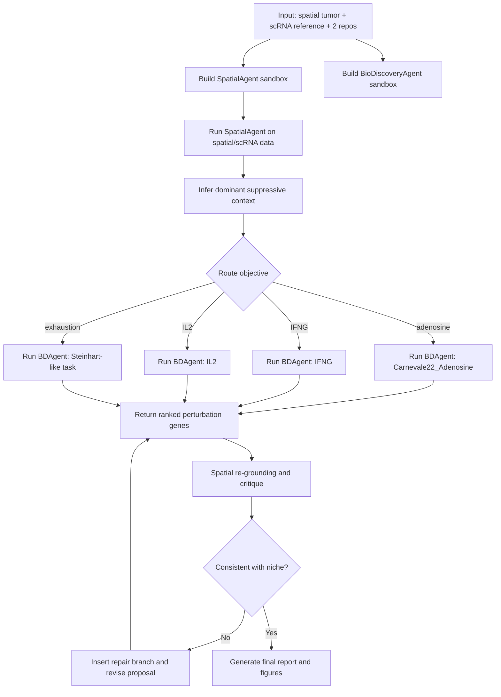

# Benchmark Specification: Spatially Grounded CRISPR Screen Design for Tumor Immune Reactivation

## 1. Overview

This benchmark is designed to test whether a computational biology agent can **reuse existing specialized AI-for-Science workflows instead of rebuilding methods from scratch**. The orchestrator is given two public GitHub repositories—**SpatialAgent** and **BioDiscoveryAgent**—and must build each repo in its own Docker/sandbox environment, make them collaborate, and solve a joint task that neither specialized agent can complete alone. SpatialAgent is an autonomous agent for spatial transcriptomics, single-cell RNA-seq, and molecular biology; its README highlights a plan-act-conclude architecture, direct code execution, 72 specialized tools, and 17 skill templates for workflows such as annotation, cell-cell interaction analysis, panel design, and spatial mapping. BioDiscoveryAgent is an AI agent for closed-loop genetic perturbation design; its repo exposes benchmark tasks such as IFNG, IL2, and Carnevale22_Adenosine, while the accompanying paper reports an average 23% improvement over Bayesian optimization baselines across five datasets and support for combinatorial perturbation design. ([GitHub][1])

The benchmark’s core scientific question is: **can an orchestrating agent convert spatial tumor-context evidence into a context-specific CRISPR perturbation proposal for immune reactivation?** In this setup, SpatialAgent analyzes a tumor sample and nominates the dominant suppressive program or niche; BioDiscoveryAgent then proposes perturbation genes for the most relevant immune-reactivation objective; the orchestrator finally feeds those perturbation candidates back through spatial context checks and produces a joint report with figures. This is intended to demonstrate **extensibility through workflow reuse**, **sandboxed repo execution**, and **dynamic multi-agent topology adaptation** rather than monolithic “from-scratch” problem solving. ([GitHub][1])

---

## 2. Why this benchmark is designed this way

The key design principle is that the benchmark should reward a system that can **take existing domain-specialized repositories as they are**, containerize them, and orchestrate them into a new scientific capability. SpatialAgent already specializes in spatial/single-cell biological reasoning and exposes a programmatic Python API in its quick-start example. BioDiscoveryAgent already specializes in iterative perturbation design and exposes a command-line entry point plus optional tool branches such as literature review, critique, Reactome search, and gene-search over external features. The benchmark therefore measures whether your orchestrator can **reuse and combine specialized workflows** rather than replacing them. ([GitHub][1])

A second reason for this design is that the two repos naturally justify **separate sandboxes**. SpatialAgent’s setup script creates a `spatial_agent` environment with **Python 3.11**, whereas BioDiscoveryAgent recommends **Python 3.10** and a separate `pip install -r requirements.txt` flow. That difference is exactly the kind of practical incompatibility that makes Docker/sandbox execution meaningful in an agent benchmark. ([GitHub][1])

A third reason is that the collaboration can be made **measurable**. BioDiscoveryAgent already comes with explicit perturbation-design benchmark tasks and an evaluation script for hit-rate analysis, including immune-relevant tasks such as IFNG, IL2, and Carnevale22_Adenosine. That lets you score the perturbation-design part offline, while the spatial-analysis side can be scored through expression/niche grounding and figure completeness. ([GitHub][2])

---

## 3. Task summary

### Task name

**Spatially Grounded CRISPR Screen Design for Tumor Immune Reactivation**

### High-level goal

Given:

* a tumor **spatial transcriptomics** dataset,
* a matched or disease-relevant **scRNA-seq reference atlas**,
* the **SpatialAgent** GitHub repo,
* the **BioDiscoveryAgent** GitHub repo,

the orchestrating agent must:

1. build and run both repos in isolated Docker/sandbox environments,
2. use SpatialAgent to identify the dominant tumor immune-suppression context,
3. route the case to the most relevant BioDiscoveryAgent perturbation objective,
4. run BioDiscoveryAgent to propose a gene batch (and optionally gene pairs),
5. send the proposed genes back through spatial grounding and critique,
6. produce figures and a final joint report.

By construction, **SpatialAgent alone** can analyze spatial context but does not optimize perturbation batches, while **BioDiscoveryAgent alone** can optimize perturbation batches but is not grounded in the tumor’s observed spatial niche. The collaboration therefore creates a new composite capability: **context-specific perturbation design from spatial evidence**.

---

## 4. Why these two specialized agents

## 4.1 SpatialAgent

SpatialAgent is a specialized autonomous agent for **spatial transcriptomics, single-cell RNA-seq, and molecular biology**. Its README states that it supports dynamic tool execution and adaptive reasoning, includes **72 specialized tools**, **17 skill templates**, and a **plan-act-conclude** architecture with direct code execution. The documented skills include workflows such as annotation, CCI, panel design, and spatial mapping, and the quick-start example shows that it can be called directly from Python as `SpatialAgent(...).run(...)`. Those properties make it a strong “upstream context-finding” agent in this benchmark. ([GitHub][1])

## 4.2 BioDiscoveryAgent

BioDiscoveryAgent is a specialized agent for **closed-loop genetic perturbation design**. Its README lists built-in datasets and tasks including **IFNG**, **IL2**, **Carnevale22_Adenosine**, **Scharenberg22**, and **Sanchez21_down**, and its command-line interface supports tool-augmented runs with literature review, critique, Reactome search, and optional gene-similarity search. Its paper reports an average **23% improvement** over Bayesian-optimization baselines across five datasets and shows support for **2-gene combinatorial perturbation design**, where it substantially outperforms random sampling. These properties make it a strong “downstream perturbation planner” for this benchmark. ([GitHub][2])

## 4.3 Why they fit together

The fit is especially clean for **tumor immune reactivation**. BioDiscoveryAgent’s task set already includes immune phenotypes such as IFNG and IL2 production, and the paper defines **Carnevale22_Adenosine** as identifying genes whose knockout would boost the efficacy of engineered T cells in the presence of an adenosine agonist that creates an immunosuppressive condition. It also defines a Steinhart CRISPRa task centered on resistance to T-cell exhaustion. That gives the orchestrator a natural set of downstream perturbation objectives to choose from after reading the tumor’s spatial immune context. 

---

## 5. Recommended dataset configuration

## 5.1 Standard benchmark track

I recommend using **human breast cancer** as the standard benchmark domain.

For the spatial input, use the public **10x Genomics Visium human breast cancer fresh-frozen** dataset. The 10x dataset page reports **4,898 spots under tissue**, **9,720 median UMIs per spot**, and **3,654 median genes per spot**, making it large enough to be spatially interesting but still manageable as a benchmark input. ([10x Genomics][3])

For the scRNA reference, use the **Wu et al. 2021 breast cancer atlas**. That study analyzed **26 primary pre-treatment tumors** and retained **130,246 single cells** after QC, explicitly aiming to characterize the cellular architecture and spatial organization of breast tumors. This is a strong reference because it covers epithelial, immune, and stromal populations that are directly relevant to tumor immune suppression and reactivation. ([PMC][4])

This pair is a good fit because breast cancer has rich immune, stromal, and malignant heterogeneity, and the Wu atlas explicitly frames breast tumors as requiring higher-resolution characterization of tissue architecture and functional cellular organization. That makes the domain scientifically plausible for a benchmark that routes from spatial context to immune-perturbation design. ([PMC][4])

## 5.2 Lightweight packaged variant

If you want a lighter-weight version that reduces data-format friction, you can package the spatial input via the Open Problems single-cell dataset hub. Their **“10X Visium - Human Breast Cancer 1”** object is already an `AnnData` with shape **4263 × 14906** and includes a raw `counts` layer, which is convenient if you want the benchmark to focus more on repo orchestration than on reconstructing spatial data objects from scratch. ([Open Problems in Single-Cell Analysis][5])

## 5.3 Hard mode

For a larger and more heterogeneous reference, replace the Wu atlas with the **Chen et al. 2026 integrated breast cancer atlas**, which reports **more than 600,000 cells across 138 patients**. That version is better for stressing scalability, ontology harmonization, memory management, and topological branching in the orchestrator. ([PMC][6])

---

## 6. Benchmark framing: measurable offline version vs. translational extension

This benchmark is easiest to evaluate in an **offline measurable version**. In that version, each benchmark instance contains:

* a spatial tumor sample and scRNA reference,
* a hidden **objective label** among a small set such as `{adenosine, IFNG, IL2, exhaustion}`,
* and a corresponding BioDiscoveryAgent task mapping.

The orchestrator does not see the label. It must infer the objective from the tumor context and route the case to the correct BioDiscoveryAgent branch. Because BioDiscoveryAgent has built-in benchmark tasks and analysis scripts, the downstream perturbation-design quality remains objectively scoreable.

A later **translational extension** can relax the hidden-label assumption and instead treat the task as open-ended scientific hypothesis generation. In that version, the score would lean more on expert review and spatial plausibility than on hidden benchmark labels.

---

## 7. Formal task definition

A benchmark instance asks the orchestrator to solve the following problem:

> Build and run the SpatialAgent and BioDiscoveryAgent repositories in isolated sandboxes. Analyze a breast-cancer spatial transcriptomics sample with a disease-relevant single-cell reference to identify the dominant immune-suppressive context. Route the case to the most relevant perturbation-design objective. Run BioDiscoveryAgent to propose a CRISPR gene batch for immune reactivation. Re-ground the proposed genes in the spatial tumor context, revise if needed, and produce a final ranked perturbation plan with supporting figures and a reproducible run report.

The benchmark is considered successful only if the run shows **real repo execution**, **real cross-agent collaboration**, and **real final artifacts**. A purely narrative answer, a rewrite of the repos from scratch, or a run that uses only one specialized agent does not count as success.

---

## 8. Suggested objective-routing scheme

A simple benchmark routing ontology is:

* **Adenosine-rich suppressive niche** → `Carnevale22_Adenosine`
* **Weak T-cell effector cytokine program / low IFNG evidence** → `IFNG`
* **Weak IL2-supporting program / proliferative helper-state failure** → `IL2`
* **Exhaustion-like T-cell niche** → `Steinhart`-style exhaustion objective

This routing scheme is justified by BioDiscoveryAgent’s documented task definitions. The IFNG and IL2 tasks explicitly target genes that regulate Interferon-gamma and Interleukin-2 production, while the Carnevale task targets genes whose knockout boosts engineered T-cell efficacy under adenosine-mediated immunosuppression; the Steinhart task targets resistance to T-cell exhaustion. 

---

## 9. End-to-end workflow design



This graph is deliberately **not fixed**. The orchestrator should be allowed to insert additional branches if something fails, such as:

* an **Environment Repair** branch if one repo does not build,
* a **Schema Adapter** branch if the spatial/reference data do not match expected formats,
* a **Parallel Objective** branch if the spatial evidence is ambiguous between IFNG and IL2,
* or a **Critique/Repair** branch if the proposed perturbation genes are not well grounded in the target niche.

That dynamic topology is one of the main things this benchmark is supposed to measure.

---

## 10. Recommended sandbox layout

Use at least two isolated execution environments:

### `sandbox_spatialagent`

Purpose:

* clone and build SpatialAgent,
* run spatial/scRNA analysis,
* produce niche summaries, context tokens, and figures.

Justification:
SpatialAgent’s repo uses `setup_env.sh` and creates a **Python 3.11** environment. ([GitHub][1])

### `sandbox_biodiscovery`

Purpose:

* clone and build BioDiscoveryAgent,
* run perturbation-design tasks,
* compute hit-rate-style evaluation with `analyze.py`.

Justification:
BioDiscoveryAgent recommends **Python 3.10**, a `pip install -r requirements.txt` flow, and exposes CLI commands for perturbation tasks plus `analyze.py` for evaluation. ([GitHub][2])

### Shared workspace

Both sandboxes should mount a shared directory such as:

```text
/work/input
/work/intermediate
/work/output
```

The orchestrator should pass information between agents through versioned files, not hidden in-memory state.

---

## 11. Input contract

A benchmark instance can use the following structure:

```text
benchmark_instance/
├── paper_context/
│   ├── spatialagent_readme.md
│   ├── biodiscoveryagent_readme.md
│   └── benchmark_task.md
├── repos/
│   ├── spatialagent_repo_url.txt
│   └── biodiscoveryagent_repo_url.txt
├── data/
│   ├── spatial/
│   │   ├── spatial_counts.h5ad
│   │   ├── histology_image.png
│   │   └── spatial_metadata.json
│   ├── reference/
│   │   ├── reference_raw.h5ad
│   │   └── reference_metadata.json
│   └── optional/
│       └── gene_alias_map.tsv
├── benchmark_hidden/
│   └── objective_label.json
└── config/
    └── run_rules.md
```

The hidden `objective_label.json` is only for evaluation; the agent must not see it.

---

## 12. Output contract

A successful run should produce something like:

```text
outputs/
├── build/
│   ├── spatialagent_build.log
│   ├── biodiscovery_build.log
│   ├── spatialagent_commit.txt
│   └── biodiscovery_commit.txt
├── spatial_context/
│   ├── celltype_map.png
│   ├── suppressive_niche_map.png
│   ├── cci_or_pathway_summary.tsv
│   ├── spatial_context_report.json
│   └── routed_objective.json
├── perturbation_design/
│   ├── biodiscovery_raw_predictions.json
│   ├── ranked_gene_batch.tsv
│   ├── optional_gene_pairs.tsv
│   └── hitrate_eval.json
├── collaboration/
│   ├── spatial_grounding_scores.tsv
│   ├── revised_ranked_gene_batch.tsv
│   ├── critique_log.json
│   └── collaboration_gain.json
├── figures/
│   ├── objective_rationale_figure.png
│   ├── final_gene_spatial_heatmap.png
│   ├── perturbation_vs_spatial_consistency.png
│   └── summary_panel.png
└── reports/
    ├── final_report.md
    ├── run_manifest.json
    └── topology_trace.json
```

---

## 13. Detailed prompt for the orchestrating agent

### 13.1 System prompt

```text
You are a computational biology orchestration agent.

You can clone GitHub repositories, build them in Docker/sandboxed environments, run code, call tools, and dynamically modify a multi-agent workflow topology.

Your goal is not to rebuild methods from scratch. Your goal is to reuse existing specialized agent workflows and make them collaborate.

In this benchmark, you are given:
1. a spatial biology agent repository,
2. a genetic perturbation-design agent repository,
3. a tumor spatial transcriptomics dataset,
4. a disease-relevant scRNA-seq reference.

You must:
- build each repo in its own isolated sandbox,
- infer a collaboration protocol between them,
- analyze the tumor immune-suppression context with the spatial agent,
- route the problem to the most relevant perturbation-design objective,
- run the perturbation-design agent,
- feed the predictions back through spatial grounding and critique,
- and produce a final ranked perturbation proposal with figures and a reproducible report.

Do not replace the original repos with your own reimplementation.
Do not assume a fixed workflow graph; add repair, critique, or parallel branches when needed.
Persist every important intermediate artifact to disk.
```

### 13.2 Task prompt

```text
Task: Spatially Grounded CRISPR Screen Design for Tumor Immune Reactivation

You are given:
- the SpatialAgent GitHub repository,
- the BioDiscoveryAgent GitHub repository,
- a human breast cancer spatial transcriptomics sample,
- a breast-cancer scRNA-seq reference atlas,
- a writable shared workspace,
- permission to execute code in isolated Docker/sandbox environments.

Your objective is to create a collaborative workflow between the two specialized agents.

Required steps:
1. Build SpatialAgent in its own sandbox and inspect its callable interface.
2. Build BioDiscoveryAgent in its own sandbox and inspect its CLI/task interface.
3. Run SpatialAgent on the tumor spatial dataset plus scRNA reference to identify:
   - major cell states,
   - immunosuppressive niches,
   - evidence for pathways or programs relevant to tumor immune suppression.
4. Convert the spatial findings into a context token or routing decision, choosing the most relevant perturbation objective among the available BioDiscoveryAgent tasks.
5. Run BioDiscoveryAgent on the selected objective to propose a CRISPR perturbation batch.
6. Re-ground the proposed genes in the tumor’s spatial context:
   - check whether the genes are expressed in relevant cell types or niches,
   - check whether the proposals are consistent with the inferred suppressive program.
7. If the proposal is poorly grounded, add a repair/critique branch and revise it.
8. Produce:
   - spatial-analysis figures,
   - perturbation-design outputs,
   - a final ranked perturbation list,
   - and a final report describing how the collaboration was constructed and why the result is scientifically plausible.

Important constraints:
- Reuse the repos rather than rewriting them.
- Use isolated sandboxes.
- Save logs, manifests, and intermediate files.
- Record every topology change you make.
```

### 13.3 Optional sub-agent prompt contracts

#### Prompt contract for the SpatialAgent branch

```text
Analyze the provided spatial tumor dataset and disease-relevant scRNA reference.
Return:
1. a summary of major cell states,
2. a summary of the dominant suppressive or immune-limiting niche,
3. a ranked list of pathways / ligand-receptor programs / candidate genes,
4. a compact context token that can be used to route downstream perturbation design.
```

#### Prompt contract for the BioDiscoveryAgent branch

```text
Given the selected perturbation objective and any optional biological priors from spatial context, propose a ranked perturbation batch.
Return:
1. a ranked gene list,
2. optional gene pairs if supported,
3. a short rationale for each major choice,
4. any internal critique or uncertainty notes.
```

#### Prompt contract for the critique branch

```text
Given a ranked perturbation proposal and the spatial context report, identify mismatches between the perturbation plan and the observed tumor niche.
Re-rank or reject genes that are poorly grounded in the spatial data.
```

---

## 14. Experimental plan

## 14.1 Main experiment

Compare the following systems on the same benchmark instances:

### A. Full collaborative system

* separate sandboxes for both repos,
* dynamic topology adaptation,
* spatial routing,
* perturbation design,
* spatial re-grounding and revision.

### B. BioDiscoveryAgent-only

The orchestrator runs BioDiscoveryAgent directly without spatial context and uses a fixed objective or a generic objective prompt.

### C. SpatialAgent-only

The orchestrator runs only SpatialAgent and stops at pathway/niche discovery, with no perturbation-design stage.

### D. Fixed-pipeline collaboration

The orchestrator uses both repos but with a rigid graph:
`SpatialAgent -> BioDiscoveryAgent -> output`, with no dynamic topology changes and no repair loop.

### E. No-sandbox baseline

The orchestrator tries to run both repos in one shared environment.

These baselines separate the value of **repo reuse**, **spatial context**, **dynamic topology**, and **sandbox isolation**.

## 14.2 Benchmark variants

### Standard

* Spatial data: 10x Visium human breast cancer
* Reference: Wu 2021 breast cancer atlas
* Objective set: `{adenosine, IFNG, IL2, exhaustion}`

### Lightweight

* Same scientific task, but use a packaged `AnnData` spatial input such as the Open Problems breast-cancer object to reduce data-loading complexity. ([Open Problems in Single-Cell Analysis][5])

### Hard

* Reference: Chen 2026 atlas instead of Wu 2021
* Allow ambiguous routing and require parallel BioDiscovery branches followed by pruning. ([PMC][6])

### Perturbed

Inject one hidden issue per instance:

* broken metadata,
* gene-symbol aliases,
* missing histology summary,
* or one repo build failure that requires a repair branch.

---

## 15. Evaluation plan

## 15.1 Repo execution metrics

Measure whether the orchestrator actually reused and executed the two repositories.

Suggested metrics:

* `build_success_spatialagent`
* `build_success_biodiscovery`
* `native_entrypoint_used`
* `sandbox_isolation_success`

This is important because the benchmark is about **workflow extensibility through repo reuse**, not just about producing a plausible answer.

## 15.2 Objective-routing metrics

For the offline measurable version, compare the routed objective to the hidden objective label.

Suggested metrics:

* top-1 routing accuracy,
* top-k routing recall,
* confidence calibration.

## 15.3 Perturbation-design metrics

Use BioDiscoveryAgent’s own task/evaluation structure where possible. The repo provides `analyze.py` for hit-rate analysis, and the paper reports hit-rate-style improvements over baselines on the built-in tasks. Suggested metrics:

* hit rate / recall,
* non-random uplift,
* optional gene-pair performance for combinatorial settings. ([GitHub][2])

## 15.4 Spatial-grounding metrics

Add a new metric family that is specific to the collaboration story.

Suggested metrics:

* expression grounding: are proposed genes expressed in relevant cell types or niches?
* niche consistency: do proposed genes align with the dominant suppressive program inferred upstream?
* context uplift: does the collaborative system yield better spatial plausibility than BioDiscoveryAgent-only?

## 15.5 Collaboration-gain metrics

This is the most important benchmark-specific score.

Suggested metrics:

* improvement over BioDiscoveryAgent-only on spatial grounding,
* improvement over SpatialAgent-only in actionability,
* improvement over fixed-pipeline collaboration after repair loops,
* number of scientifically justified topology changes.

## 15.6 Example aggregate score

```text
Final Score =
0.20 * Repo Execution
+ 0.15 * Objective Routing
+ 0.25 * Perturbation Design Quality
+ 0.20 * Spatial Grounding
+ 0.10 * Collaboration Gain
+ 0.10 * Reproducibility
```

---

## 16. Hidden failure cases worth including

To make the benchmark meaningfully agentic, include realistic failure modes such as:

* SpatialAgent builds but its expected data path is wrong.
* BioDiscoveryAgent runs, but the selected objective is ambiguous.
* The reference atlas uses different gene symbols than the spatial data.
* The initial perturbation proposal is not expressed in the inferred niche.
* One repo requires a repair branch because the default environment spec is insufficient.

These failure modes are what make dynamic topology matter.

---

## 17. Expected results

A strong orchestrator should:

1. successfully build both repos in separate sandboxes,
2. run SpatialAgent to produce an interpretable spatial-context report,
3. route the case to the most relevant BioDiscoveryAgent task,
4. generate a perturbation batch with measurable hit-rate quality,
5. reject or down-rank poorly grounded genes,
6. produce final figures and a reproducible report,
7. and log when it inserted new branches into the workflow graph.

The final outputs should look like a real joint scientific artifact, not two disconnected agent runs stitched together. In particular, the final report should answer a question of the form:

> **“Given this tumor’s spatial immune-suppression context, here is the perturbation objective we should prioritize, here are the genes we should test next, and here is why those genes are plausible in this specific tissue context.”**

A weak system will usually fail in one of four ways:

* it cannot build and reuse the repos,
* it can run one repo but not coordinate them,
* it picks perturbation objectives without spatial justification,
* or it cannot revise proposals when the spatial critique exposes inconsistencies.

---

## 18. Why this benchmark is good evidence of extensibility

This benchmark is a strong extensibility test because it asks the orchestrator to do something that researchers increasingly want in practice: **take existing specialized AI-for-Science systems and compose them into a new scientific workflow**. SpatialAgent already provides rich spatial and molecular reasoning capabilities; BioDiscoveryAgent already provides closed-loop perturbation planning with benchmarkable objectives. The orchestrator’s job is to **reuse, isolate, connect, and adapt** those workflows. If your system succeeds here, the result is strong evidence that it can extend scientific capability by **orchestrating existing repositories**, not just by generating fresh code. ([GitHub][1])

If you want, I can next turn this into a **paper-ready experimental section** with a tighter “Methods / Experimental Setup / Baselines / Metrics” presentation and cleaner benchmark tables.

[1]: https://github.com/Genentech/SpatialAgent "GitHub - Genentech/SpatialAgent: An AI agent for spatial biology · GitHub"
[2]: https://github.com/snap-stanford/BioDiscoveryAgent/blob/master/README.md "BioDiscoveryAgent/README.md at master · snap-stanford/BioDiscoveryAgent · GitHub"
[3]: https://www.10xgenomics.com/datasets/human-breast-cancer-visium-fresh-frozen-whole-transcriptome-1-standard "Human Breast Cancer: Visium Fresh Frozen, Whole Transcriptome | 10x Genomics"
[4]: https://pmc.ncbi.nlm.nih.gov/articles/PMC9044823/ "
            A single-cell and spatially resolved atlas of human breast cancers - PMC
        "
[5]: https://openproblems.bio/datasets/tenx_visium/visium/human_breast_cancer_1 "10X Visium - Human Breast Cancer 1 - Open Problems in Single-Cell Analysis"
[6]: https://pmc.ncbi.nlm.nih.gov/articles/PMC12867518/ "
            A highly resolved integrated single-cell atlas of human breast cancers - PMC
        "
